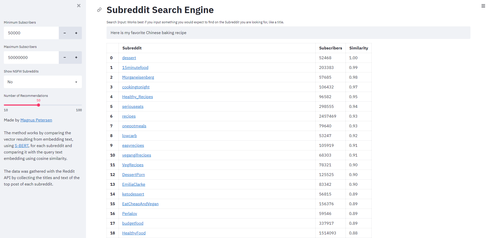

# Recomenddit
Recomenddit is a natural langue processing-based search engine for subreddits, topic focused forums, on the site Reddit. A search query in the form of text one might find on the desired subreddit is compared to text from around 100.000 subreddits on the site. The website also allows for customised search parameters such as subreddit subscriber count and an adult content filter. 

## Purpose
Reddit offers a wide range of interesting communities from mainstream forums featuring dog pictures to niche interests like flyfishing. However, it has become the victim of its own success, since the more subreddits there are the harder it is to find one that fits one’s interest. Subreddits are mostly popularized by word of mouth. To fix this I decided to build a website, that will help find subreddits of interest.
## Methodology
### Data Collection
The Data was collected using the Reddit API. First, I created a data frame of all subreddits with more that 5000 subscribers and then requested all titles, subreddit summary and text of the top 100 posts to create a database of relevant text for each subreddit, alongside some subreddit meta-data. 
### Model Theory
The website encodes the search quarry with Sentence-BERT [1] and compares it to the previously encoded subreddit text data frame. 
Sentence-BERT, is a modification of the pretrained BERT network that use Siamese and triplet network structures to derive semantically meaningful sentence embeddings that can be compared using cosine-similarity.
## Sources
[1] Nils Reimers, Iryna Gurevych. Sentence-BERT: Sentence Embeddings using Siamese BERT-Networks.
